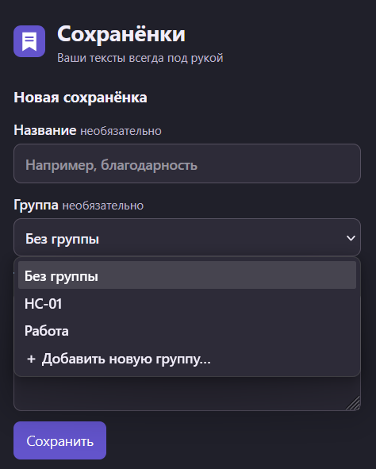
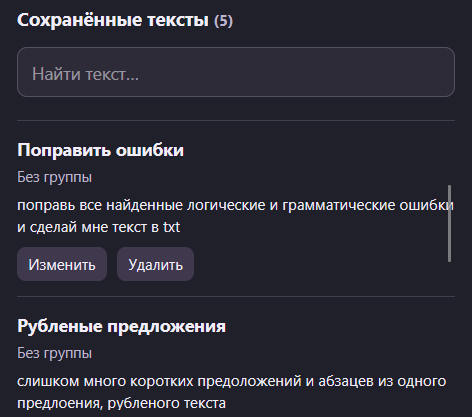
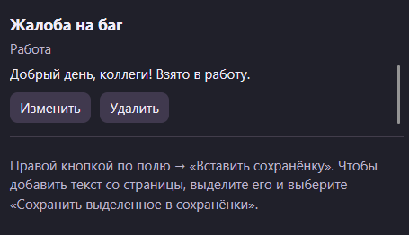
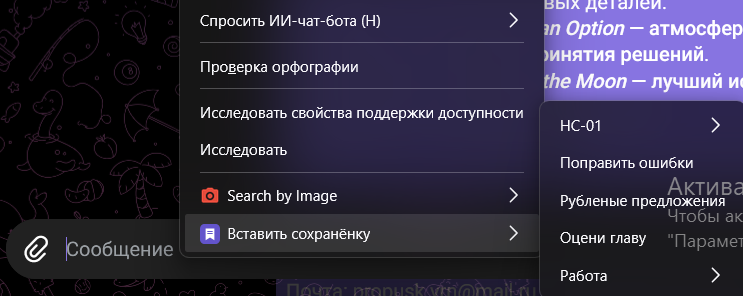
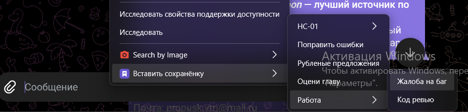

# Сохранёнки для Firefox

Отдельное расширение: сохраняет ваши тексты и вставляет их через правую кнопку мыши. Не зависит от checkAO3.

## Установка для использования и проверки

1. Откройте Firefox и перейдите на `about:debugging#/runtime/this-firefox`.
2. Нажмите «Загрузить временное дополнение».
3. Выберите `manifest.json` из папки проекта `D:\projects\saved-text`, либо архив `saved-text.zip` из той же папки.
4. Откройте «Сохранёнки» через кнопку расширений (пазл) на панели Firefox. При желании закрепите кнопку на панели.

Временное дополнение работает до перезапуска Firefox. Для постоянной установки в обычный Firefox нужна подпись Mozilla: архив можно отправить на addons.mozilla.org как непубличное дополнение. Архив в проекте не подписан. Перед удалением или перезагрузкой временного дополнения сохраните важные тексты отдельно: временная установка не предназначена для долговременного хранения.

## Как пользоваться

- В окне расширения введите текст и нажмите «Сохранить». Название и группа необязательны.
- В списке «Группа» выберите существующую группу или «Добавить новую группу…» и введите название. Новая группа появится в списке после сохранения текста. «Без группы» оставляет текст непосредственно в меню вставки.
- Щёлкните правой кнопкой внутри поля ввода → «Вставить сохранёнку» → выберите текст. Если задана группа, она откроется ещё одним боковым списком.
- Выделенный в поле фрагмент заменяется. Иначе текст вставляется в текущую позицию курсора; перед открытием меню поставьте курсор в нужное место.
- Чтобы сохранить текст со страницы: выделите его → правая кнопка → «Сохранить выделенное в сохранёнки». Затем можно изменить название и группу через окно расширения. Буфер обмена для этого не нужен.
- Через окно расширения доступны поиск, изменение и удаление. Удаление выполняется сразу.

Поддерживаются обычные текстовые поля, многострочные поля и стандартные редакторы `contenteditable`, в том числе во фреймах, к которым Firefox разрешает доступ. В нестандартных редакторах сайта вставка может не сработать. Расширение вставляет обычный текст, без HTML-форматирования. В полях email без доступного выделения резервная вставка добавляет текст в конец.

Firefox запрещает работу расширений на некоторых страницах, включая служебные страницы браузера и защищённые страницы Mozilla. Это расширение предназначено для полей веб-страниц, а не адресной строки или интерфейса браузера.

Тексты хранятся локально в профиле Firefox, не синхронизируются и никуда не отправляются. Разрешения: `storage` для хранения, `menus` для контекстного меню, `activeTab` для вставки после вашего действия, `notifications` для сообщений о сохранении и ошибках. Постоянный доступ ко всем сайтам не запрашивается.

## Использование

Скриншоты показывают работу расширения в Firefox: выбор группы, сохранённые тексты и вставку через контекстное меню.

### 1. Открыть расширение и создать сохранёнку

Откройте «Сохранёнки» кнопкой на панели Firefox, заполните текст и нажмите «Сохранить».

В списке «Группа» выберите существующую группу, «Без группы» или «Добавить новую группу…».

### 2. Найти или изменить сохранённый текст

Сохранёнки доступны под формой. Поиск фильтрует список; кнопки позволяют изменить или удалить запись.

### 3. Вставить текст через правую кнопку мыши

Нажмите правой кнопкой в поле ввода, выберите «Вставить сохранёнку» → «Работа» → «Жалоба на баг».

Выбранный текст появится в поле ввода:

